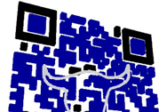



TCart - Tu carrito de compras
====================

Aplicación móvil diseñada con [PhoneGap](http://phonegap.com/).  

Otras librerías contenidas en este desarrollo son:

* [jQuery](http://www.jquery.com).
* [jQuery mobile](http://jquerymobile.com/).
* [Fast click](https://github.com/ftlabs/fastclick).
* [ChartJS](http://www.chartjs.org/).
* [RandomColor](https://github.com/sterlingwes/RandomColor).
* Librería propia de acceso para este desarrolo **jquery.login-mobile.js** y **index.css**.

Acessos para pruebas.
---------------------
* Gabriela Guevara
 + `usuario: 0567`
 + `contraseña: 0567`

* Carlos Lima 
 + `usuario: 2360`
 + `contraseña: entrada`

Instalación.
------------

Ejecutar el archivo **index.html** desde cualquier navegador.
Sin embargo el desarrollo se ha hecho con Google Chrome el cual soporta la mayor parte de efectos y velocidad requerida para la aplicación.
